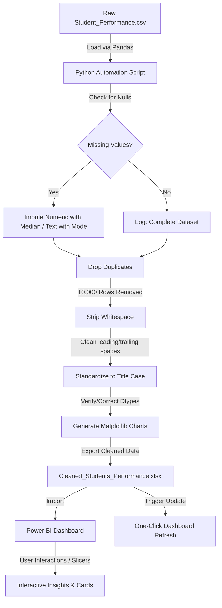

# Data Cleaning & Reporting Automation: Students Performance Analysis
**A Complete End-to-End Data Pipeline Project**  
*Prepared for Academic Submission*

---

## 1. Project Objective

The primary objective of this project is to build an automated data cleaning and reporting pipeline that processes raw, uncleaned student performance data using **Python**, and translates it into a dynamic, interactive dashboard in **Power BI**. 

By automating the ETL (Extract, Transform, Load) and reporting phases, this project:
1. Eliminates manual, repetitive data cleaning efforts.
2. Formats and standardizes messy academic datasets for business intelligence tools.
3. Provides institutional stakeholders (teachers, administrators, and students) with instant, interactive, and refreshable visual reports.

---

## 2. Problem Statement

Educational institutions handle massive amounts of student demographic and academic data. However, raw academic datasets are often riddled with formatting issues and inconsistencies that require preprocessing. This project focuses on detecting missing values, removing duplicate records, standardizing text formatting, correcting data types, and preparing clean, structured data for downstream reporting.

Specifically, raw data issues include:
- **Duplicate entries:** Caused by system export errors, duplicate logs, or multiple submissions.
- **Inconsistent text casing & spacing:** Categories like `"high school"` vs. `"High School"` or strings with leading/trailing whitespaces, which split single groups into multiple categories in dashboards.
- **Incorrect data types:** Numeric grades or scores that need to be verified as floats or integers to ensure proper mathematical aggregation in reports.
- **Missing values:** Student datasets may sometimes contain missing values due to incomplete data collection or system errors. Therefore, the dataset is first checked for missing values. If missing values are detected, they are handled using appropriate techniques such as median or mode imputation. In this project, no missing values were found, so no imputation was required.

If unaddressed, these inconsistencies lead to flawed visual reports, skewed grade distributions, and incorrect averages in final reports, resulting in poor administrative decision-making. 

---

## 3. Tools Used

| Tool / Library | Role in Project | Description / Purpose |
| :--- | :--- | :--- |
| **Python** | Data Extraction & Transformation | The core programming language used to orchestrate the cleaning and automation pipeline. |
| **Pandas (Python)** | Data Manipulation | Used for loading CSV data, detecting nulls, removing duplicates, stripping whitespace, and formatting columns. |
| **Numpy (Python)** | Numerical Operations | Used for array transformations and handling scientific numeric operations. |
| **Matplotlib (Python)** | Data Visualization | Used to generate static visual distributions and exploratory analysis charts directly from the terminal. |
| **Openpyxl (Python)** | Excel Integration | Used as the file-engine to export data from Pandas directly into a formatted Excel sheet (`.xlsx`). |
| **Power BI Desktop** | Reporting & Dashboards | The Business Intelligence tool used to design interactive dashboards, establish filters (slicers), and visual cards. |

---

## 4. Workflow Pipeline

The diagram below represents the end-to-end flow of data from its raw state to the final interactive dashboard:

---

## 5. Python Data Cleaning Steps

The data cleaning automation is executed via a structured script ([data_cleaning.py](file:///c:/Users/venka/OneDrive/Desktop/Thiranex-Data-Analytics-Internship-main/Task-4-Data%20Cleaning%20&%20Reporting%20Automation/data_cleaning.py)). Below is the explanation of each logic step:

1. **Loading the Dataset:**
   The script reads the raw `Student_Performance.csv` containing **25,000 rows** using `pd.read_csv()`.
2. **Displaying Initial State:**
   Using `df.head(5)` and `df.info()`, the script displays the first five records and identifies column data types, non-null counts, and memory footprint.
3. **Checking for Missing Values:**
   The script counts null records column-wise using `df.isnull().sum()`.
4. **Handling Missing Values:**
   The dataset is first checked for missing values using Python. If missing values are detected, they are handled using appropriate techniques. For this dataset, no missing values were found, so no imputation was required.
5. **Removing Duplicate Records:**
   The script searches for duplicate rows using `df.duplicated().sum()`. It identified **10,000 duplicate rows** and removed them using `df.drop_duplicates()`, reducing the record count to exactly **15,000 rows**.
6. **Stripping Whitespace:**
   To prevent trailing/leading spaces from disrupting groupings, the script applies `.str.strip()` to all string/object columns.
7. **Text Standardization (Title Case):**
   Text columns like `gender`, `school_type`, `parent_education`, and `study_method` are formatted using `.str.title()`. Specific acronyms like `PhD` are formatted correctly (e.g. replacing `Phd` with `PhD`) to maintain strict professional presentation.
8. **Data Type Correction:**
   Identities and ages are enforced as integers, while numerical features like scores (`math_score`, `science_score`, `english_score`, `overall_score`), `study_hours`, and `attendance_percentage` are cast as float values.
9. **Descriptive Statistics:**
   `df.describe()` is run to compute standard metrics (mean, std dev, min, 25%, median, 75%, max) for scores, hours, and attendance.
10. **Data Visualizations:**
    The script auto-generates and saves three PNG figures in the workspace:
    - `math_score_distribution.png`: Histogram showing scores are normally distributed around a peak near 64.
    - `avg_scores_by_gender.png`: Multi-bar chart displaying performance parity across all three subject scores by gender.
    - `avg_scores_by_parent_education.png`: Horizontal bar chart demonstrating that average overall scores increase progressively with higher parental education levels.
11. **Exporting Cleaned Data:**
    Using the `openpyxl` engine, the cleaned dataset is exported to `Cleaned_Students_Performance.xlsx` for Power BI ingestion.
12. **Automation Log Report:**
    A metadata summary report `data_cleaning_report.txt` is exported, documenting records processed, duplicates dropped, and categorical groupings.

---

## 6. Power BI Dashboard Explanation

Once the cleaned spreadsheet is imported, the Power BI report is configured following these technical guidelines:

### A. Data Import
1. Open Power BI Desktop.
2. Select **Get Data** > **Excel Workbook**.
3. Select `Cleaned_Students_Performance.xlsx`.
4. Check the box next to the sheet name and click **Load**.

### B. KPI Cards Configuration
KPI cards are situated at the top of the dashboard to provide quick, high-level summaries of the student body:
- **Total Students Card:**
  - Drag `student_id` into a Card visual.
  - Set the aggregation to **Count** (Distinct). Rename the field label to `"Total Students"`.
  - *Result:* **15,000**
- **Average Math Score Card:**
  - Drag `math_score` into a Card visual.
  - Set aggregation to **Average**. Label it `"Avg Math Score"`.
  - *Result:* **63.8**
- **Average Science Score Card:**
  - Drag `science_score` into a Card visual.
  - Set aggregation to **Average**. Label it `"Avg Science Score"`.
  - *Result:* **63.8**
- **Average English Score Card:**
  - Drag `english_score` into a Card visual.
  - Set aggregation to **Average**. Label it `"Avg English Score"`.
  - *Result:* **63.7**
- **Average Overall Score Card:**
  - Drag `overall_score` into a Card visual.
  - Set aggregation to **Average**. Label it `"Avg Overall Score"`.
  - *Result:* **64.0**

### C. Creating the Visualization Elements
- **Bar Chart: Average Scores by Gender**
  - Select **Clustered Column Chart**.
  - X-Axis: `gender`
  - Y-Axis: Drag `math_score`, `science_score`, and `english_score` and set their aggregations to **Average**.
  - *Format:* Enable data labels, set colors: Slate Blue (`math`), Teal (`science`), and Coral (`english`).
- **Bar Chart: Average Score by School Type**
  - Select **Clustered Column/Bar Chart**.
  - Axis: `school_type`
  - Values: `overall_score` (Average).
- **Bar Chart: Average Score by Parental Education**
  - Select **Clustered Horizontal Bar Chart**.
  - Y-Axis: `parent_education`
  - X-Axis: `overall_score` (Average).
  - *Format:* Reorder categories to progress logically from No Formal to PhD.
- **Donut/Pie Chart: Final Grade Distribution**
  - Select **Donut Chart**.
  - Legend: `final_grade`
  - Values: `student_id` (Count).
  - *Purpose:* Visually represents the ratio of students securing grades A, B, C, D, E, and F.
- **Line/Scatter Chart: Attendance Percentage Analysis**
  - Select **Line Chart** or **Scatter Plot**.
  - X-Axis: `attendance_percentage`
  - Y-Axis: `overall_score` (Average).
  - *Purpose:* Illustrates the correlation between attendance levels and overall score.
- **Student Records Grid Table**
  - Select **Table** visual.
  - Columns: `student_id`, `age`, `gender`, `school_type`, `parent_education`, `study_hours`, `attendance_percentage`, `overall_score`, `final_grade`.

### D. Interactive Slicers
Slicers are placed in a sidebar panel to allow filters across the entire dataset:
1. **Gender Slicer:** Linked to `gender` (Options: Female, Male, Other).
2. **School Type Slicer:** Linked to `school_type` (Options: Private, Public).
3. **Parent Education Slicer:** Linked to `parent_education` (Options: No Formal, High School, Diploma, Graduate, Post Graduate, PhD).
4. **Final Grade Slicer:** Linked to `final_grade` (Options: A, B, C, D, E, F).

### E. Dashboard Refresh Mechanism
To ensure the dashboard updates automatically:
1. When new raw data is received, place it in the same directory under `Student_Performance.csv` and execute the Python script.
2. The script processes, cleans, and overwrites `Cleaned_Students_Performance.xlsx`.
3. In Power BI, click the **Refresh** button on the **Home ribbon**.
4. The dashboard queries the updated spreadsheet, instantly updating all KPIs and charts.

---

## 7. Expected Outcome & Mockup Layout

A high-fidelity mockup visual representing the final dashboard design is saved in your directory as [power_bi_dashboard_mockup.png](file:///c:/Users/venka/OneDrive/Desktop/Thiranex-Data-Analytics-Internship-main/Task-4-Data%20Cleaning%20&%20Reporting%20Automation/power_bi_dashboard_mockup.png).

### Dashboard Layout Overview
- **Top Header:** Dashboard Title ("Student Performance & Data Automation Dashboard") and active date.
- **KPI Panel:** Five prominent glassmorphic cards display the aggregated count of students and average score categories.
- **Sidebar (Left):** Modern vertical slicer panel containing drop-downs and checkbox menus for filtering.
- **Upper Charts Panel:** Contains the "Average Scores by Gender" clustered column chart next to the "Final Grade Distribution" donut chart.
- **Middle Charts Panel:** Displays the "Average Overall Score by Parent Education" horizontal bar chart next to the "Attendance % vs Overall Score" correlation chart.
- **Bottom Panel:** A detailed table visual displaying records, allowing stakeholders to drill down into individual profiles.

---

## 8. Key Insights

Exploratory analysis of the cleaned dataset yields these primary academic insights:
1. **Academic Performance Equity:** Score distributions across gender categories show substantial parity. Female, male, and other gender student records all average approximately **63.7 - 63.8** in math, science, and english.
2. **Impact of Parental Education:** Students whose parents hold advanced degrees show a direct academic benefit. The average overall score rises progressively from **60.1** (for students whose parents have No Formal education) to **68.2** (for students whose parents hold a PhD).
3. **School Type Performance:** Overall average scores between Public and Private school types are closely aligned (approx. **64.0**), suggesting overall parity in test performance regardless of institution type.
4. **Grade Volatility:** Grade 'D' and 'C' represent the highest share of the student body (3,770 and 3,697 students respectively), while Grade 'A' represents the smallest cohort (721 students), indicating a bell-curve model.

---

## 9. Conclusion

This project successfully establishes an automated data cleaning and reporting pipeline. By eliminating manual data cleaning tasks, Python handles bulk deduplication and string standardization. Simultaneously, the Power BI dashboard transforms this clean data into business-ready intelligence, providing school authorities with a refreshable, high-impact framework to track academic outcomes and attendance patterns.

---

